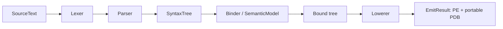

# Architecture

## Pipeline

`Cobol.Compiler` follows a Roslyn-inspired, immutable public shape:

* `SourceText`, `TextSpan`, and `Location` carry source identity.
* `SyntaxTree` exposes tokens, trivia, immutable syntax nodes, and parse diagnostics.
* `Compilation` owns trees and produces `SemanticModel`, diagnostics, and `EmitResult`.
* The binder creates immutable data-item symbols and validates identifier use.
* The lowerer currently produces an internal C# representation for a bootstrap backend. It is intentionally isolated behind `Compilation.Emit`.

## Emission and determinism

The backend creates a deterministic `Microsoft.CodeAnalysis.CSharp.CSharpCompilation` and calls its supported `Emit` API with `DebugInformationFormat.PortablePdb`. This produces a managed console assembly or library plus portable PDB. The compiler resolves framework metadata from the runtime's `TRUSTED_PLATFORM_ASSEMBLIES` set, avoiding machine-specific hand-maintained framework references.

This is not a source-to-source product surface: the compiler owns parsing, diagnostics, symbols, validation, lowering, and an emission contract. The temporary backend is an implementation seam, not a COBOL-to-C# compatibility promise. Direct `System.Reflection.Metadata` IL/metadata emission is the next backend milestone.

## Integration surfaces

* `cobolc input.cob [-o output.dll] [--library]` is the command line.
* `Cobol.MSBuild.CobolCompile` compiles a source item and is accompanied by `build/Cobol.MSBuild.targets` for package integration.
* `editor/vscode-cobol` contains language IDs, grammar, snippets, configuration diagnostics, and a deliberately non-launching LSP hand-off point.

## Explicit current gaps

There is no incremental compilation, workspace/project system, analyzer API, refactoring API, language server, debugger integration, optimizer, mainframe data-set support, copybook preprocessor, or cross-platform runtime library. See [roadmap.md](roadmap.md).
