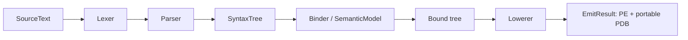

# Architecture

## Pipeline

`Cobol.Compiler` follows a Roslyn-inspired, immutable public shape:

* `SourceText`, `TextSpan`, and `Location` carry source identity.
* `SyntaxTree` exposes original source, normalized parser tokens, leading trivia, immutable syntax nodes, parent links, spans/full spans, missing tokens, parser recovery nodes, and parse diagnostics.
* The syntax representation is an immutable, position-bearing red tree with frozen `ImmutableArray` children/tokens. Parent links are established only during tree construction, then never mutated. Unlike Roslyn's green/red split, 0.1 does not intern a separate positionless green layer because it does not yet support incremental parsing; it preserves the same externally inspectable node/token/trivia invariants. A green layer is an explicit incremental-compilation milestone.
* `SyntaxFactory`, `SyntaxVisitor`, and `SyntaxRewriter` provide the first tool-facing construction and traversal surface. The rewriter currently preserves structural sharing by returning original nodes; typed replacement factories are a next tooling milestone.
* `Compilation` owns trees and produces `SemanticModel`, diagnostics, source/metadata references, and `EmitResult`.
* The binder builds program, paragraph, field, and built-in type symbols in a case-insensitive scope; `SemanticModel` supports declared-symbol, symbol-info, and type-info queries.
* The lowering boundary has typed `BoundNode`/`BoundStatement`/`BoundBlock` nodes. The bootstrap backend currently retains validated source statements below that boundary.

## Emission and determinism

The backend creates a deterministic `Microsoft.CodeAnalysis.CSharp.CSharpCompilation` and calls its supported `Emit` API with `DebugInformationFormat.PortablePdb`. This produces a managed console assembly or library plus portable PDB. The compiler resolves framework metadata from the runtime's `TRUSTED_PLATFORM_ASSEMBLIES` set, avoiding machine-specific hand-maintained framework references.

This is not a source-to-source product surface: the compiler owns parsing, diagnostics, symbols, validation, lowering, and an emission contract. The temporary backend is an implementation seam, not a COBOL-to-C# compatibility promise. Deterministic configuration is tested by byte-for-byte repeat emission; tests also inspect the managed entry-point/MVID plus portable-PDB documents and sequence-point blobs. Direct `System.Reflection.Metadata` IL/metadata emission is the next backend milestone.

## Integration surfaces

* `cobolc input.cob [-o output.dll] [--library]` is the command line.
* `Cobol.MSBuild.CobolCompile` compiles a source item and is accompanied by `build/Cobol.MSBuild.targets` for package integration.
* `editor/vscode-cobol` contains language IDs, TextMate grammar, snippets, editing configuration, and a compiler-backed diagnostics bridge. It invokes `cobolc` without a shell after save or the explicit validation command, maps parsed locations back to saved or staged unsaved documents, and exposes diagnostics through the VS Code collection API. It is not yet a JSON-RPC LSP server; document symbols, hover, completion, navigation, and rename remain future LSP work.

## Explicit current gaps

There is no incremental compilation or green-node cache, workspace/project system, analyzer API, typed replacement rewriter API, debugger integration, optimizer, mainframe data-set support, copybook preprocessor, or cross-platform runtime library. See [roadmap.md](roadmap.md).
